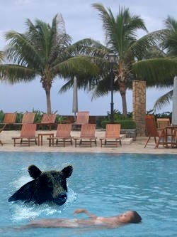
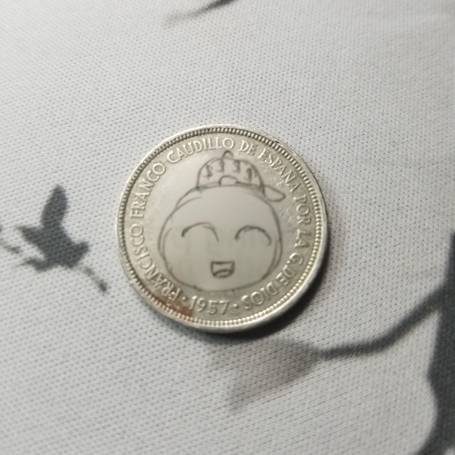
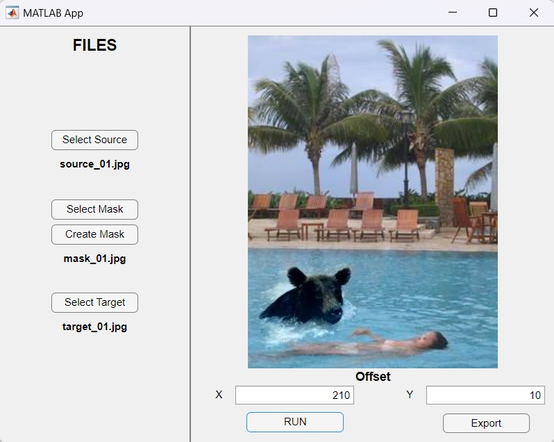

<!-- PROJECT LOGO -->
<div align="center">
  <a href="https://github.com/andreihar/poisson-blending">
    
  </a>
  
# Poisson Blending


<!-- PROJECT SHIELDS -->
[![Contributors][contributors-badge]][contributors]
[![Licence][licence-badge]][licence]
[![LinkedIn][linkedin-badge]][linkedin]

**Poisson Image Blending**

Method for seamlessly blending a source image into a target image by preserving gradient consistency, using Poisson’s equation to eliminate visible seams and achieve smooth transitions.


</div>


---


<!-- TABLE OF CONTENTS -->
<details open>
  <summary>Table of Contents</summary>
  <ol>
    <li><a href="#about-the-project">About The Project</a></li>
    <li><a href="#built-with">Built With</a></li>
    <li><a href="#run">Run</a></li>
    <li>
      <a href="#functional-areas">Functional Areas</a>
      <ul>
        <li><a href="#poisson-image-blending">Poisson Image Blending</a></li>
        <li><a href="#app">App</a></li>
      </ul>
    </li>
    <li><a href="#contributors">Contributors</a></li>
    <li><a href="#licence">Licence</a></li>
  </ol>
</details>


<!-- ABOUT THE PROJECT -->
## About The Project

Poisson Blending is a project developed for the course in Computational Photography and Image Manipulation in the Spring semester of 2024. This project is inspired by the seminal work of [Pérez, Gangnet, and Blake on Poisson Image Editing][perez]. The primary focus is on seamlessly blending a source image into a target image by preserving the gradient information, which effectively hides any noticeable seams and creates a smooth transition between the images.

The project's objective was to implement the Poisson Image Blending technique, which involves solving Poisson's equation to maintain gradient consistency across the blended region. The application allows users to select source and target images, define a mask for blending, and adjust placement parameters. By formulating and solving a least-squares optimisation problem, the application ensures that the gradients of the source image are preserved while matching the target image's surrounding pixels.

This project highlights the practical utility of gradient-domain processing for image compositing, demonstrating how it can be used to achieve high-quality, seamless image blends. It provides a valuable tool for digital content creation and photo editing, showcasing the effectiveness of advanced image processing techniques in creating visually coherent and natural-looking composites.

### Built With

* [![MATLAB][matlab-badge]][matlab]


<!-- RUN -->
## Run

All relevant code is located in the `matlab` folder. To run the main script, run:

```matlab
main
```

The `App` folder features a MATLAB App that can be opened by running the `PoissonBlending.exe` file.


<!-- FUNCTIONAL AREAS -->
## Functional Areas

### Poisson Image Blending

Poisson Image Blending is a technique for seamlessly combining images by solving Poisson’s partial differential equation in the gradient domain. This method aims to blend a source image into a target image such that the transition between the images is smooth, preserving the gradients of the source image while maintaining the target's pixel values. The core idea is to minimise intensity differences at the boundaries where the source and target images meet, thereby avoiding noticeable seams. The implementation involves setting up a large linear system where the objective is to match gradients between the source and target images while ensuring that known pixels in the target image remain unchanged.

To solve the blending problem, the project first formulates the Poisson equation for the masked region in the source image. The least squares problem is solved using sparse matrix capabilities to handle the large system efficiently. The blending process is applied to both grayscale and colour images, where each colour channel is processed independently. By constructing a sparse matrix that encodes the Poisson equation constraints, the algorithm ensures a smooth transition between images. Special attention is given to handling boundary conditions and optimising the matrix operations to achieve high performance even for large images.

<p align="center">



</p>

### App

The Poisson Image Blending project features a MATLAB app designed using App Designer, which simplifies the image blending process. Users can easily select source and target images, create or load masks, and define the offset for placing the source image on the target image. The app provides an intuitive interface for visualising the blending results in real-time and allows users to export the final blended image. This tool offers a user-friendly way to experiment with and apply Poisson image blending techniques, making complex image compositing tasks more accessible and efficient.

<p align="center">

</p>


<!-- CONTRIBUTION -->
## Contributors

- Andrei Harbachov ([Github][andrei-github] · [LinkedIn][andrei-linkedin])


<!-- LICENCE -->
## Licence

Because Poisson Blending is MIT-licensed, any developer can essentially do whatever they want with it as long as they include the original copyright and licence notice in any copies of the source code.


<!-- MARKDOWN LINKS -->
<!-- Badges and their links -->
[contributors-badge]: https://img.shields.io/badge/Contributors-1-44cc11?style=for-the-badge
[contributors]: #contributors
[licence-badge]: https://img.shields.io/github/license/andreihar/poisson-blending.svg?color=000000&style=for-the-badge
[licence]: LICENSE
[linkedin-badge]: https://img.shields.io/badge/LinkedIn-0077B5?style=for-the-badge&logo=linkedin&logoColor=white
[linkedin]: https://www.linkedin.com/in/andreihar/
[matlab-badge]: https://img.shields.io/badge/matlab-08609d?style=for-the-badge&logo=zalando&logoColor=ffffff
[matlab]: https://www.mathworks.com/products/matlab.html/

<!-- Technical links -->
[perez]: https://www.cs.jhu.edu/~misha/Fall07/Papers/Perez03.pdf

<!-- Socials -->
[andrei-linkedin]: https://www.linkedin.com/in/andreihar/
[andrei-github]: https://github.com/andreihar